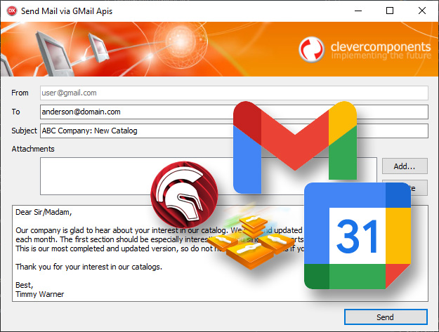

# Google REST APIs for Delphi

This GitHub repository provides Delphi classes for Google APIs together with test classes that are included in a DUnit project.   

The current version of the Google APIs for Delphi library provides access to Gmail and Google Calendar APIs, and we are working on adding the other Google Workspace REST APIs.   

The library obsoletes the [GitHub/CleverComponents/Google-Calendar-API](https://github.com/CleverComponents/Google-Calendar-API) project.   

Google REST APIs for Delphi utilizes RTTI to serialize JSON to Delphi classes and Clever Internet components to implement HTTPS and OAUTH protocols.   
See the [GitHub/CleverComponents/Json-Serializer](https://github.com/CleverComponents/Json-Serializer) repository and the [Clever Internet Suite](https://www.clevercomponents.com/products/inetsuite/) website for more details.   

You can start investigating the project from tests for Gmail message sending. Please open the GoogleApis.Gmail.Tests.pas source file and navigate to the TGmailMessagesTests.TestSend method.   

This method shows how to compose a simple email message, send, and delete this message from your Gmail inbox folder. The used email message represents a small test-plain message.   

For more complex emails, you can use the TclMailMessage component. All you need is to use the TclMailMessage.MessageSource.Text property to get the raw message content and supply to the TMessage class.   

Also the repository includes an example of using Gmail to send mail from your Delphi app. Just try it and see how it works:   
https://github.com/CleverComponents/Google-Apis/tree/main/examples/gmail/SendMail

All tests utilize our test Google App project, which is not validated at this time.   
You will need to specify your own project's client ID and Secret within the GetService function (is also declared in GoogleApis.Gmail.Tests.pas).   

When running the DUnit test project, the program automatically opens the Google Login form, authenticates, and performs the messages, labels, drafts, and other tests using the connected Gmail account.   

How to use:   
1. Please clone the [GitHub/CleverComponents/Google-Apis](https://github.com/CleverComponents/Google-Apis) repository.
2. Download and install the [Clever Internet Suite](https://www.clevercomponents.com/downloads/inetsuite/suitedownload.asp) library.
3. Add the following paths to your Delphi project's settings: src\core;src\gmail;lib\Json-Serializer\json. See the SendMail.dproj example for more details.
4. Enjoy.

Please feel free to [Contact Us](https://www.clevercomponents.com/support/) and ask any program related questions.   

Keep updated on [Facebook](http://www.facebook.com/clevercomponents)   [YouTube](https://www.youtube.com/channel/UC9Si4WNQVSeXQMjdEJ8j1fg)   [Twitter](https://twitter.com/CleverComponent)   [Telegram](https://t.me/clevercomponents)   [Newsletter](https://www.clevercomponents.com/home/maillist.asp)   
